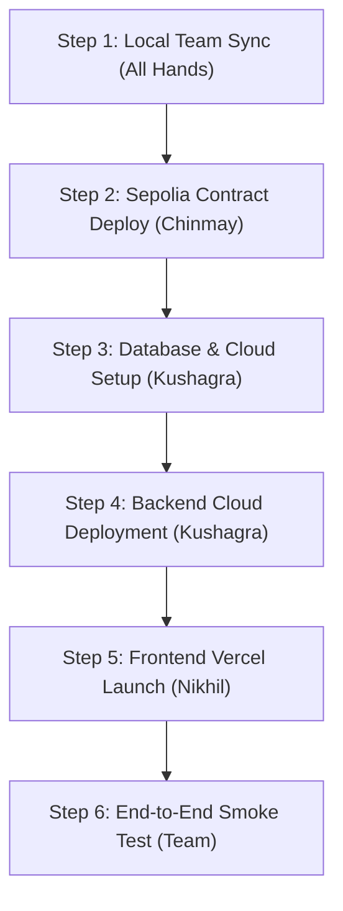

# 🚀 BlockBloom DAO — Step-by-Step Production Launch Roadmap

This step-by-step guide maps out the path from your current local codebase to a live production launch on Ethereum Sepolia Testnet.

---

## 🗺️ Execution Timeline & Order



---

## 🏃‍♂️ Step 1: Local Team Sync (All Hands)
* **Goal:** Ensure all teammates have identical, working development environments before staging.
* **Tasks:**
  1. Have Chinmay and Kushagra run `git pull origin main` to pull down the recent configuration fixes (Wagmi Sepolia default, Mongo memory variable bypass, and Gemini grace fallbacks).
  2. Test the setup locally using the `testing_steps.txt` guide. 
  3. Verify that the AI Copilot drawer functions correctly (even if the Gemini API key is left blank, it should now fall back gracefully with configuration instructions instead of returning 500 errors).

---

## ⛓️ Step 2: Sepolia Contract Deployment (Chinmay)
* **Goal:** Deploy the smart contracts to the public testnet so the backend and frontend can interact with them.
* **Tasks:**
  1. Open a terminal in `/hardhat`.
  2. Create a secure local file `hardhat/.env` (do NOT commit to Git) and populate it with:
     ```env
     API_URL=https://eth-sepolia.g.alchemy.com/v2/YOUR_ALCHEMY_OR_INFURA_KEY
     PRIVATE_KEY=your_deployer_wallet_private_key
     ETHERSCAN_API_KEY=your_etherscan_api_key
     ```
  3. Deploy the contracts:
     ```bash
     npx hardhat run scripts/deploy-local.js --network sepolia
     ```
  4. Copy the resulting deployed contract addresses for **`BloomToken`** and **`DAOFactory`** and share them with Nikhil and Kushagra.

---

## ☁️ Step 3: Database & Cloud Services Setup (Kushagra)
* **Goal:** Set up persistent production infrastructure.
* **Tasks:**
  1. **MongoDB Cloud:** Create a free shared cluster on [MongoDB Atlas](https://cloud.mongodb.com). Whitelist network access (`0.0.0.0/0`) and copy the connection string.
  2. **Rotate Gemini Key:** Go to [Google AI Studio](https://aistudio.google.com/apikey) and generate a fresh API key.
  3. **WalletConnect ID:** Register a new free project on [WalletConnect Cloud](https://cloud.walletconnect.com) and copy the project ID.

---

## ⚙️ Step 4: Backend Cloud Deployment (Kushagra)
* **Goal:** Deploy the server and indexer to handle public API calls and sync Sepolia transactions.
* **Tasks:**
  1. Link the `/backend` folder to a hosting provider dashboard (Render, Railway, or Heroku).
  2. Set up the production Environment Variables in the platform dashboard:
     ```env
     NODE_ENV=production
     USE_IN_MEMORY_DB=false
     MONGODB_URI=mongodb+srv://your_atlas_uri
     RPC_URL=https://eth-sepolia.g.alchemy.com/v2/YOUR_ALCHEMY_KEY
     DAO_FACTORY_ADDRESS=0x_sepolia_address_from_step_2
     BLOOM_TOKEN_ADDRESS=0x_sepolia_address_from_step_2
     CORS_ORIGIN=https://blockbloom.vercel.app  # (Set to your Vercel URL)
     JWT_SECRET=generate_a_random_32_character_string
     GEMINI_API_KEY=your_fresh_api_key
     ```
  3. Start the server and copy the public URL (e.g. `https://blockbloom-api.onrender.com/api`). Share it with Nikhil.

---

## 🎨 Step 5: Frontend Vercel Launch (Nikhil)
* **Goal:** Host the user interface globally and point it to the production backend.
* **Tasks:**
  1. Open [frontend/src/contracts.json](file:///e:/Blockboom/BlockBloom_GDG_Project-main/BlockBloom_GDG_Project-main/FinalTask/frontend/src/contracts.json) and replace the Hardhat addresses with the Sepolia contract addresses from Step 2.
  2. Commit and push the address update to `main`.
  3. Deploy the `/frontend` directory on **Vercel**.
  4. Configure environment variables in the Vercel dashboard:
     ```env
     VITE_API_BASE=https://your-backend.railway.app/api  # (From Step 4)
     VITE_REQUIRED_CHAIN_ID=11155111
     VITE_WALLETCONNECT_PROJECT_ID=your_walletconnect_id_from_step_3
     ```
  5. Under WalletConnect settings (Reown Cloud), add your live Vercel domain to the **Domain Allowlist**.

---

## 🧪 Step 6: End-to-End Smoke Test (All Hands)
* **Goal:** Confirm the entire live ecosystem behaves perfectly.
* **Test Checklist:**
  - [ ] Open the Vercel frontend URL.
  - [ ] Connect MetaMask (ensure network is switched to Ethereum Sepolia).
  - [ ] Deploy a new test DAO (sign with MetaMask).
  - [ ] Create a proposal and submit it.
  - [ ] Cast votes and watch the real-time leaderboard update.
  - [ ] Ask the AI Copilot chatbot questions about the new Sepolia proposals.
