# 🚀 BlockBloom DAO — Phase 4: Production & Scaling Roadmap

With the local MVP complete (including Multi-DAO deployments, Event Indexing, real-time WebSocket Leaderboard, and Grounded AI Copilot), the next major milestone is **production scaling and deployment**.

Below is the roadmap for Phase 4, outlining key responsibilities and goals for each team member.

---

## ⛓️ Chinmay: Smart Contract Hardening & Testnet Deployment

**Primary Goal:** Transition the smart contracts from a local Hardhat network to a secure, verified public testnet (Sepolia/Polygon Amoy) and ensure they are audit-ready.

### 1. Security & Access Control
* **Access Roles:** Integrate OpenZeppelin's `AccessControl` or `Ownable` in the `DAOFactory` and governance contracts to secure admin-only functions.
* **Reentrancy Protection:** Add `ReentrancyGuard` to prevent double-withdrawal or voting state manipulation exploits.
* **Unit Testing Coverage:** Achieve >95% testing coverage in `hardhat/test/` focusing on edge cases (tie votes, zero-token voting, expired proposal interactions).

### 2. Gas Optimization & Public Deployments
* **Gas Audits:** Use `hardhat-gas-reporter` to find high-gas loops and optimize storage layouts.
* **Testnet Deployment:** Write Ethers.js/Hardhat Ignition deployment scripts targeting Ethereum Sepolia.
* **Etherscan Verification:** Automatically verify deployed bytecode on Etherscan for trust and transparency.

---

## ⚙️ Kushagra: Backend Scale & Production Hosting

**Primary Goal:** Move the backend API, event indexer, and AI services from localhost to a secure cloud platform with persistent databases.

### 1. Database & Cloud Transition
* **MongoDB Atlas:** Set up a production-ready cloud database cluster on MongoDB Atlas. Migrate local schemas and set up read/write access credentials.
* **Hosting (Render / Railway / AWS):** Host the Express server. Configure process monitors (PM2) or serverless configurations.
* **Environment Security:** Use secure secret management for critical API keys (e.g. `GEMINI_API_KEY`, RPC URLs, database credentials).

### 2. Robust Event Indexing & Security
* **RPC Redundancy:** Set up fallback RPC URLs (e.g., Alchemy + Infura) to prevent event indexer downtime during rate-limiting.
* **Security & Auth:** Implement Sign-In with Ethereum (SIWE) so users sign a cryptographic message with MetaMask to authenticate off-chain API requests (like updating profile details or saving draft proposals).
* **CORS & Rate Limiting:** Enforce strict CORS origins and implement rate-limiters (e.g., `express-rate-limit`) to prevent API abuse.

---

## 🎨 Nikhil: Frontend UX Polish & Wallet Abstraction

**Primary Goal:** Deploy the client interface to a global CDN (Vite + Vercel) and implement premium UX components.

### 1. Wallet Abstraction & Premium Layouts
* **Web3 Social Logins:** Integrate social login fallbacks (like Particle Network or Web3Auth) inside RainbowKit to onboard non-crypto users easily.
* **Production Deployment:** Host the frontend on Vercel or Netlify. Configure custom domains and SSL.
* **Data Visualization:** Replace simple voting metrics with rich, interactive charts (using `recharts` or `chart.js`) showing voting history over time.

### 2. Theme Continuity & Offline States
* **UI Polish:** Ensure all modals, loaders, and toast notifications respect the global glassmorphism theme styling.
* **Offline Handling:** Add custom alert banners if the backend server or web3 RPC disconnects.

---

## 💡 Next-Gen Shared Features (Future Sprits)

These features will elevate BlockBloom DAO to a premium market competitor:

1. **Quadratic Voting:** Upgrade governance voting to use quadratic weights, reducing the influence of token whales and boosting community-driven voices.
2. **Timelock Controller:** Deploy a Timelock contract so that proposals have a mandatory delay (e.g., 2 days) before execution, allowing dissenting users to withdraw funds if they disagree.
3. **Discord/Telegram Notification Bots:** Hook backend WebSocket events to a bot that notifies members in chat channels whenever a new DAO is deployed or proposal goes live.
4. **On-Chain Treasury Execution:** Allow proposals to contain transaction payloads that execute automatically upon passing (e.g., automatically sending funds from the treasury to a recipient address).

---

## 📅 Proposed Phase 4 Timeline

```mermaid
gantt
    title BlockBloom Phase 4 Timeline
    dateFormat  X
    axisFormat %d
    
    section Sprint 1: Hardening & Config
    Security & Test Coverage (Chinmay)   :active, 0, 7
    MongoDB Atlas & Env Setup (Kushagra) :active, 0, 7
    Frontend CDN & Deploy Base (Nikhil) :active, 0, 7
    
    section Sprint 2: Cloud Integration
    Sepolia Deploy & Verification (Chinmay) : 7, 14
    Backend Host & RPC Setup (Kushagra)    : 7, 14
    Wagmi Sepolia Hookup (Nikhil)          : 7, 14
    
    section Sprint 3: Security & Polish
    SIWE Backend Auth (Kushagra)           : 14, 21
    Social Login & Chart UI (Nikhil)       : 14, 21
    Beta Testing & Launch (Team)           : 18, 21
```

### 📆 Sprint 1: Security Hardening & Infrastructure Setup (Days 1 - 7)
* **Chinmay:** Implement OpenZeppelin security helpers (`AccessControl`, `ReentrancyGuard`) and achieve 95%+ testing coverage on local contracts.
* **Kushagra:** Create a MongoDB Atlas cluster, configure CORS rules, and secure environment secrets.
* **Nikhil:** Set up Vercel hosting for the frontend and build out standard UI fallback states for slow networks.

### 📆 Sprint 2: Testnet Deployment & Event Indexer Hookup (Days 8 - 14)
* **Chinmay:** Write and run Sepolia deployment scripts, verify contract sources on Etherscan, and supply deployed contract addresses to the team.
* **Kushagra:** Migrate the event indexer from the local Hardhat RPC provider to a Sepolia Infura/Alchemy endpoint and host the backend REST API on Railway/Render.
* **Nikhil:** Configure `wagmi.js` to default to Ethereum Sepolia, import the new contract ABIs and addresses, and bind user transaction flows.

### 📆 Sprint 3: Wallet Sign-in, Charts, & Launch (Days 15 - 21)
* **Kushagra:** Establish Sign-in with Ethereum (SIWE) on the backend to authenticate API requests for AI history and profile changes.
* **Nikhil:** Design voting graphs using `recharts`, integrate custom RainbowKit modal templates, and implement SIWE login on the client.
* **Team:** Conduct system-wide integration tests, confirm contract/backend synchronization, and launch the beta!

---

## 🤝 What We Need to Share with Each Other (Handoff List)

To keep development frictionless, share the following items as they are ready:

### 1. From Chinmay (Smart Contracts) to the Team:
* **JSON ABIs:** Export files from `artifacts/contracts/` for `BloomToken` and `DAOFactory`.
* **Sepolia Addresses:** Provide the exact addresses of deployed contracts.
* **Etherscan Links:** Verified contract source URLs for easy validation.

### 2. From Kushagra (Backend Architecture) to the Team:
* **Hosted Backend Base URL:** (e.g. `https://api.blockbloom.io/api`) so Nikhil can configure the frontend client.
* **WebSocket Endpoint:** The production URL for Socket.IO synchronization.
* **SIWE Schema Details:** The formatted message template that the frontend needs to request from MetaMask.

### 3. From Nikhil (Frontend Client) to the Team:
* **Vercel Production Domain:** (e.g., `https://blockbloom.vercel.app`) so Kushagra can whitelist it in the backend's CORS configurations.
* **Figma/Design Updates:** Any UI-specific adjustments to keep everyone aligned on UX.

### 4. Shared API Tokens & Secrets (Stored Safely outside of Git):
* **Gemini API Key:** Shared for testing AI assistant performance.
* **WalletConnect Project ID:** Shared for Web3 connection configuration.
* **Database URI:** Access to the staging database for debugging server endpoints.
